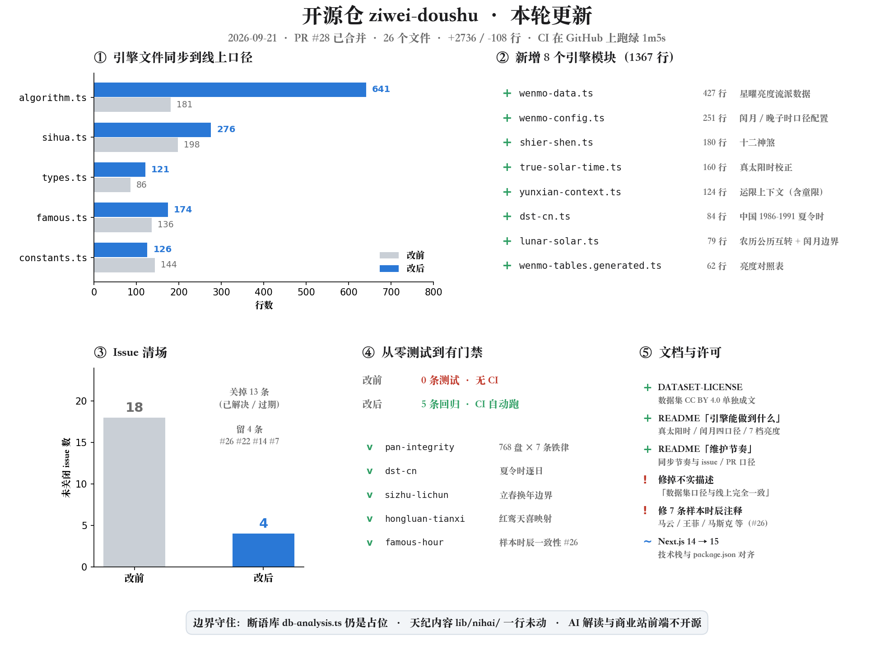

# 紫微斗数 · 开源排盘引擎

[](https://github.com/Renhuai123/ziwei-doushu/actions/workflows/ci.yml)
[](./LICENSE)
[](./DATASET-LICENSE)

基于**倪海夏《天纪》**教学体系的紫微斗数排盘系统，包含完整排盘算法、四化系统、格局知识库、古籍原文数据，以及 **51.8 万条命盘样本数据**。

> 🎉 **网站已完成 ICP 备案**（渝ICP备2026013379号-1），主域名已正式上线、全部功能正常访问。
>
> 直接访问主域名 **https://metisziwei.com** 即可，排盘 / AI 解读 / 命盘历史等全部功能均已开放。
>
> 💕 **发财的小手点一下，小红书 / 抖音 / 闲鱼 / X 关注：王多鱼AI**，第一时间看上线 + 解锁更多紫微干货～

---

## 目录

| | 章节 | 一句话 |
|---|------|--------|
| 一 | [本轮更新](#一本轮更新2026-09-21) | 时隔三个月，引擎同步 + 补上回归与 CI |
| 二 | [51.8 万命盘样本数据集](#二518-万命盘样本数据集) | 规格、下载、用途、许可 |
| 三 | [快速开始](#三快速开始) | 克隆到跑起来 |
| 四 | [排盘引擎](#四排盘引擎) | 能做到什么、文件怎么分、古籍数据 |
| 五 | [界面是一份 Demo](#五界面是一份-demo) | 不是线上那套，差距写明 |
| 六 | [开源边界](#六开源边界什么不在里面) | 什么开源、什么不开源 |
| 七 | [维护节奏与贡献](#七维护节奏与贡献) | 同步节奏、issue / PR 口径 |
| 八 | [协议](#八协议) | 代码 MIT / 数据 CC BY 4.0 / 古籍公版 |
| 九 | [关于与联系](#九关于与联系) | 项目理念、技术栈、联系方式 |

---

## 一、本轮更新（2026-09-21）



时隔三个月，本仓库完成一次完整更新（[PR #28](https://github.com/Renhuai123/ziwei-doushu/pull/28)，26 个文件、+2736 / −108 行）：

**1. 排盘引擎同步到线上口径** —— `algorithm.ts` 从 181 行到 641 行，另更新 sihua / types / constants / patterns / cities / famous；新增 8 个模块（1367 行）：

| 模块 | 作用 |
|------|------|
| `true-solar-time.ts` | 真太阳时校正（经度差 + 均时差） |
| `dst-cn.ts` | 中国 1986–1991 夏令时 |
| `lunar-solar.ts` | 农历 / 公历互转与闰月边界 clamp |
| `wenmo-data.ts` / `wenmo-tables.generated.ts` / `wenmo-config.ts` | 星曜亮度流派数据与对照表、闰月与晚子时口径配置 |
| `shier-shen.ts` | 十二神煞 |
| `yunxian-context.ts` | 运限上下文（含童限） |

**2. 补上回归测试与 CI** —— 此前本仓库没有任何测试。现在 5 条排盘回归，`npm test` 一条命令跑完，每次 push 与 PR 在 GitHub Actions 上自动跑。

**3. 修掉样本时辰注释错位**（[#26](https://github.com/Renhuai123/ziwei-doushu/issues/26)）—— `famous.ts` 里 11 条名人样本有 7 条的时辰注释与 `hour` 索引不符（`hour` 一直是**时辰地支索引 0–11**，不是 0–23 的小时数）。已改正并加回归钉住。

**4. 积压 issue 从 18 条清到 4 条**，留下的都是还在走的。

**5. 文档与许可** —— 新增 [`DATASET-LICENSE`](./DATASET-LICENSE)；README 补齐引擎能力清单、维护节奏、开源边界；修正两处不实描述（数据集「口径与线上完全一致」、界面「完整的 Next.js 15 前端」）。

---

## 二、51.8 万命盘样本数据集

> **下载位置：本仓库右侧 [Releases](https://github.com/Renhuai123/ziwei-doushu/releases/tag/v3.0-samples) 页面**

我们开源了一套完整的紫微斗数命盘样本数据集，覆盖 **51.8 万种排盘组合**（年 60 × 月 12 × 日 30 × 时 12 × 性别 2），每条样本包含完整的命盘结构和基于倪海夏体系的解读文本。

### 2.1 数据规格

| 项目 | 说明 |
|------|------|
| 样本数量 | **518,400 条** |
| 总大小 | 5.5 GB（分 3 卷压缩） |
| 体系 | 倪海夏《天纪》正统（纯飞星派已下线） |
| 内容 | 命盘 JSON + 13 主题解读文本（命格总览、财运、事业、感情、健康等） |
| 验证 | 男女命差异化 100%、健康含子午流注 100%、女命含妇科保养 100% |
| 口径 | 由 **v3 版排盘引擎 + 当期断语库**生成；线上引擎在持续更新，新版输出与本数据集可能有差异 |

### 2.2 下载方式

前往 [Releases](https://github.com/Renhuai123/ziwei-doushu/releases/tag/v3.0-samples) 下载以下文件：

```
ziwei-samples-v3-part1.zip.001  (1.9 GB)
ziwei-samples-v3-part2.zip.002  (1.9 GB)
ziwei-samples-v3-part3.zip.003  (1.8 GB)
SHA256SUMS.txt                  (校验文件)
```

下载后合并解压：

```bash
# macOS / Linux
cat ziwei-samples-v3-part*.zip.* > combined.zip
unzip combined.zip

# Windows (PowerShell)
Get-Content ziwei-samples-v3-part*.zip.* -Encoding Byte -ReadCount 0 | Set-Content combined.zip -Encoding Byte
Expand-Archive combined.zip
```

### 2.3 用途

- 微调小模型的训练语料（51.8 万 input-output 配对）
- AI 对话的 RAG 检索源
- 修改 `patterns.ts` 后做 A/B 基线对比
- 紫微斗数研究与数据分析

### 2.4 数据许可与引用

📂 **完全开源 · 可自由商用** —— 你可以在任何项目里使用这套数据，包括但不限于：

- 商业产品 / SaaS / 付费应用
- AI 模型微调（开源或闭源模型均可）
- 二次开发、再分发、衍生数据集
- 学术研究、技术博客、教学课程

无需付费、无需申请、无需事先告知。

**唯一的要求是保留数据来源标注（attribution）**：

> 本项目使用了 **紫微斗数开源样本数据集 v3.0**（518,400 条）
> 来源：https://github.com/Renhuai123/ziwei-doushu
> 作者：王多鱼AI

放在哪里都行：

- **网页 / 产品**：About 页 / 关于我们 / 数据来源 / 页脚，写一行链接即可
- **AI 模型**：模型卡（Model Card）或数据集卡（Dataset Card）的 "Training Data" 字段
- **学术论文**：参考文献或致谢章节
- **二次发布的数据集**：README 或 metadata 文件里注明上游来源

仅此一条，其余都自由。完整条款见 [DATASET-LICENSE](./DATASET-LICENSE)。希望这套数据能帮你做出好东西 —— 做出来记得来小红书 / 抖音 / 闲鱼 **@王多鱼AI** 打个招呼 👋

---

## 三、快速开始

```bash
# 克隆
git clone https://github.com/Renhuai123/ziwei-doushu.git
cd ziwei-doushu

# 安装依赖
npm install

# 配置环境变量
cp .env.example .env.local
# 编辑 .env.local，填入你的 AI API Key

# 启动开发服务器
npm run dev
```

本地验证：

```bash
npm run typecheck   # TypeScript 全量类型检查
npm test            # 排盘引擎回归（768 盘 × 紫微铁律、夏令时、立春边界、红鸾天喜、样本时辰一致性）
```

每次 push 与 PR 都会在 GitHub Actions 上跑同一套（见 [`.github/workflows/ci.yml`](./.github/workflows/ci.yml)）。

> 注意：开源版不含后端 API 路由，AI 解读功能需要你自行实现 `/api/interpret` 等接口。排盘引擎与 Demo 界面可独立运行。

---

## 四、排盘引擎

排盘内核全部在 `lib/ziwei/`。

### 4.1 能做到什么（与常见排盘库的差异）

| 能力 | 说明 |
|------|------|
| **真太阳时校正** | 按出生地经度算时差 + 均时差，避免东西向差一个时辰 |
| **中国夏令时** | 1986–1991 年的夏令时区间自动扣除 |
| **闰月四种口径** | 闰月归前月 / 归后月 / 按日切分 / 按本月，可配置，不写死一派 |
| **晚子时换日** | 23:00–23:59 按次日排盘、00:00–00:59 按本日；换日策略可切换 |
| **星曜亮度 7 档** | 庙 / 旺 / 得 / 利 / 平 / 不 / 陷，另保留 3 档粗分类做显示降级 |
| **亮度流派可切换** | 不同流派（含文墨不同版本）对辅星亮度判法不一致，做成开关而非写死 |
| **四化与飞星** | 生年四化、大限 / 流年四化、飞星自化 |
| **十二神煞** | 本命层按生年支起，流年层改按流年支起 |
| **格局判定** | 1100+ 行规则库（紫府同宫、日月并明、七杀朝斗等） |

### 4.2 文件怎么分

| 文件 | 说明 |
|------|------|
| `algorithm.ts` | 完整排盘流程：安命宫、定五行局、安十四主星、安辅星、排大限流年 |
| `constants.ts` | 天干地支、十四主星、辅星常量 |
| `sihua.ts` | 四化飞星系统（禄权科忌），含各天干四化对照表 |
| `patterns.ts` | **1100+ 行格局知识库**：紫府同宫、日月并明、七杀朝斗等经典格局判定规则 |
| `heming-knowledge.ts` | 合盘方法论：倪师体系下双盘比对逻辑 |
| `types.ts` | TypeScript 类型定义 |
| `cities.ts` | 中国城市经纬度，用于真太阳时校正 |
| `famous.ts` | 历史名人命盘示例数据 |
| `wenmo-data.ts` / `wenmo-tables.generated.ts` / `wenmo-config.ts` | 星曜亮度流派数据与对照表、闰月与晚子时口径配置 |
| `shier-shen.ts` | 十二神煞（本命按生年支起、流年层按流年支起） |
| `true-solar-time.ts` | 真太阳时校正（经度差 + 均时差） |
| `dst-cn.ts` | 中国 1986–1991 夏令时年份与区间 |
| `yunxian-context.ts` | 运限上下文（含童限处理） |
| `lunar-solar.ts` | 农历 / 公历互转与闰月边界 clamp |

### 4.3 古籍原文（`lib/classics/`）

- **骨髓赋**（`gusuifu.ts`）— 紫微斗数核心歌诀
- **紫微斗数全集**（`quanji.ts`）— 清代古本
- **紫微斗数全书**（`quanshu.ts`）— 陈希夷传本

### 4.4 SEO 知识图谱（`lib/seo/`）

14 主星 × 12 宫位的结构化知识数据，可用于内容生成或知识库构建。

---

## 五、界面是一份 Demo

界面代码在 `app/` 与 `components/`。仓库里的界面是**一套最小可运行示例**，作用是把排盘引擎跑起来、把盘画出来，方便你在它基础上做自己的产品。**线上商业版的界面不在开源范围内**，两者差距很大：

| 页面 / 组件 | 本仓库（Demo） | 线上商业版 |
|------|------|------|
| 排盘页 `app/chart/page.tsx` | 75 行 | 1227 行 |
| 解读面板 `InsightPanel` | 467 行 | 5088 行 |
| 命盘方格 `ChartBoard` | 285 行 | 1334 行 |
| 宫位格 `PalaceCell` | 201 行 | 1192 行 |
| 合盘页 `app/heming/page.tsx` | 368 行 | 1937 行 |

**Demo 能跑通的**：出生信息表单、命盘方格与宫位详情、本命 / 大限 / 流年切换、古籍阅读器（全文搜索）、命理百科（14 主星 × 12 宫位）、亮暗主题、移动端适配。

**Demo 里没有的**：线上重做过的交互界面、AI 流式解读、合盘图谱、分享卡片，以及**断语内容本身**（`db-analysis.ts` 是占位实现）。也就是说，Demo 画得出盘，但给不出线上那套解读。

---

## 六、开源边界：什么不在里面

| | 内容 |
|---|---|
| ✅ **开源** | 排盘引擎（`lib/ziwei/`）、古籍公版原文（`lib/classics/`）、SEO 知识图谱（`lib/seo/`）、Demo 界面、51.8 万样本数据集 |
| ❌ **不开源** | 断语库（`lib/ziwei/db-analysis.ts` 是占位，线上是上万行的 13 主题断语）、AI 解读 prompt、后端 API（`/api/interpret` 等）、用户系统（登录 / 会员 / 支付）、服务端安全（签名、防刷、水印）、部署配置 |

如果你需要 AI 解读能力，可以参考 `lib/ziwei/patterns.ts` 和 `heming-knowledge.ts` 里的知识库，结合任意 LLM 自行构建 prompt。

---

## 七、维护节奏与贡献

这个仓库是**排盘引擎 + 数据集的开放快照**，不是一个全职维护的开源产品，说清楚免得大家猜：

- **引擎同步**：随线上发版同步 `lib/ziwei/` 的引擎层并打 tag；断语库、AI 解读、商业站前端不在同步范围内。
- **Issue**：会看，但回复可能不及时；带复现步骤或具体盘例（年月日时 + 性别 + 哪一条不对）的问题优先处理。
- **PR**：欢迎，尤其是回归测试、口径修正、文档。动到排盘口径的改动请附上依据（古籍原文或可核对的对照）。

---

## 八、协议

本仓库分三部分授权，都是宽松协议，**商用没有任何限制**：

| 内容 | 协议 | 简单说 |
|------|------|--------|
| **代码**（`lib/`、`app/`、`components/`） | [MIT License](./LICENSE) | 拿去随便用，保留 LICENSE 文件即可 |
| **数据**（Releases 中的 51.8 万样本数据集 v3.0） | [CC BY 4.0](./DATASET-LICENSE) · 要求 attribution | 商用也行，**注明数据来源即可** |
| **古籍原文**（骨髓赋、紫微斗数全集 / 全书等） | Public Domain | 古书都是公有领域，不存在版权 |

**一句话**：拿去用，商用也行，把数据来源链接带上就行。

---

## 九、关于与联系

### 项目理念

紫微斗数是中国传统命理学的瑰宝，倪海夏老师在《天纪》中系统梳理了正宗的紫微斗数体系。我们希望通过技术手段让更多人接触和学习这门学问。

开源排盘算法和知识库，是因为我们相信：**算法是公开的传统智慧，不应该被锁在围墙里**。真正的价值在于解读的深度、用户体验的打磨、以及持续运营的积累。

想自己搭？代码都在这里，拿去用。嫌麻烦？来 [metisziwei.com](https://metisziwei.com) 直接用。

### 技术栈

- **框架**：Next.js 15（App Router）
- **语言**：TypeScript
- **样式**：Tailwind CSS + CSS Variables 设计系统
- **排盘**：基于 [iztro](https://github.com/SylarLong/iztro) + lunar-javascript
- **动画**：Framer Motion

### 联系

- 线上平台：[metisziwei.com](https://metisziwei.com)
- Issues：欢迎提 Bug 和建议
- 小红书 / 抖音 / 闲鱼 / X：**王多鱼AI**
